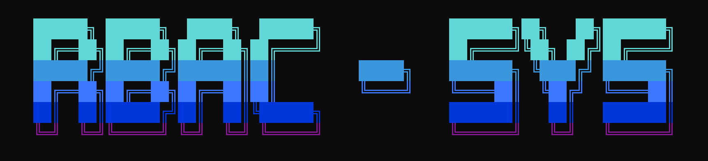
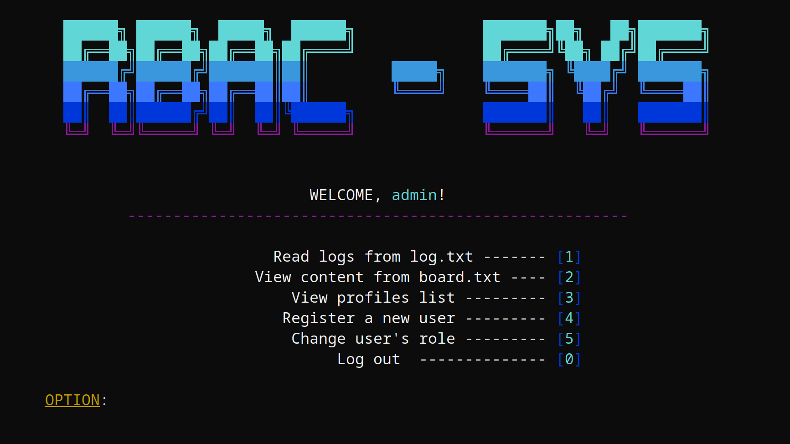
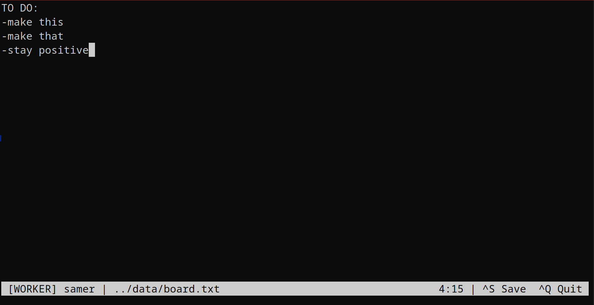

# RBAC System v1.0

A terminal-based **Role-Based Access Control** system written in **C++17**.  
Developed as a university seminar project to demonstrate access control, 
file persistence, credential encryption, and clean MVC architecture.

 

---

## Table of Contents

1. [About The Project](#about-the-project)
2. [Key Features](#key-features)
3. [Technical Overview](#technical-overview)
4. [Project Structure](#project-structure)
5. [Getting Started](#getting-started)
6. [Controls](#controls)
7. [License](#license)
8. [Contact](#contact)

---

## About The Project

RBAC System is a closed terminal application that simulates a real-world 
role-based access control environment. Users authenticate via a login system 
and are granted permissions based on their assigned role — **ADMIN** or **WORKER**.

The project was built to explore C++ fundamentals in a practical context: 
file I/O, encryption simulation, session management, and layered architecture.

 

---

## Key Features

### Roles & Permissions
| Action | WORKER | ADMIN |
|--------|--------|-------|
| View `board.txt` | ✅ | ✅ |
| Edit `board.txt` | ✅ | ✅ |
| Read `log.txt` | ❌ | ✅ |
| View user list | ❌ | ✅ |
| Register new user | ❌ | ✅ |
| Change user role | ❌ | ✅ |

### Authentication
- Login with username and password
- 3 failed attempts → returns to login screen
- All login attempts logged with timestamp

### In-Terminal Editor
- Nano/Vim inspired text editor built on **ncurses**
- Edit `board.txt` directly in terminal
- Status bar shows role, username, filename, cursor position
- `Ctrl+S` save, `Ctrl+Q` exit with unsaved change guard

### Logging
- Every action (LOGIN, LOGOUT, READ, EDIT, REGISTER, ROLE_CHANGE) 
  is written to `log.txt` with timestamp
- Format: `[YYYY-MM-DD HH:MM:SS] ROLE username ACTION "details"`
- Only ADMIN can read logs

### Credential Encryption
- Passwords stored as XOR + Base64 encoded strings
- Never stored or compared in plaintext
- Simulation of real-world credential hashing (SHA256 + salt equivalent)

### Custom TUI Engine
- Hand-written rendering using ANSI escape sequences
- Colors, cursor manipulation, typing animations, loading bars

---

## Technical Overview

### Architecture

MVC-inspired layered architecture:

#### Models (`src/models`)
- `Person` — username, encrypted password, role (ADMIN/WORKER/UNKNOWN)
- `JobRole` enum class — open for extension

#### Views (`src/views`)
- `MenuView` — logo, role-specific menus, `optionBox()` input handler
- `TableView` — user roster table rendering
- `Animation.h` — ANSI TUI engine (colors, animations, cursor control)

#### Controllers (`src/controllers`)
- `AuthController` — central service: holds roster cache + current session
- `AdminController` — admin scene orchestrator
- `WorkerController` — worker scene orchestrator

#### Editor (`src/editor`)
- `Editor` — ncurses text editor, MVC in miniature:
  - `_lines` vector = model
  - `draw()` = view
  - `handleKey()` = controller

#### Utils (`src/utils`)
- `Tools` — CSV I/O, TXT I/O, encrypt/decrypt, logger format, datetime
- Cache pattern: `loadCSV` once on boot, `appendCSV`/`rewriteCSV` on mutation

### Memory Management
- `std::shared_ptr<Person>` — current session user
- `std::vector<Person>` — roster cache (value semantics)
- No raw `new`/`delete`

### Encryption
- XOR cipher with multi-character key `"RBAC2025"`
- Base64 encoding to ensure CSV-safe output
- Same function encrypts and decrypts (XOR symmetry)
- Noted as simulation — production equivalent: SHA256 + salt

---

## Project Structure
```text
rbac-system/
├── CMakeLists.txt
├── data/
│   ├── users.csv       # Username,Password(encrypted),Role
│   ├── board.txt       # Worker editable file
│   └── log.txt         # Admin read-only log
├── docs/
│   └── assets/
├── include/
│   ├── controllers/
│   │   ├── AuthController.h
│   │   ├── AdminController.h
│   │   └── WorkerController.h
│   ├── editor/
│   │   └── Editor.h
│   ├── models/
│   │   └── Person.h
│   ├── utils/
│   │   ├── Tools.h
│   │   └── Animation.h
│   └── views/
│       ├── MenuView.h
│       └── TableView.h
└── src/
    ├── main.cpp
    ├── controllers/
    ├── editor/
    ├── models/
    ├── utils/
    └── views/
```

---

## Getting Started

### Prerequisites
- GCC 9+ or Clang 10+
- CMake 3.16+
- ncurses (`sudo apt install libncurses5-dev`)

### Installation
```bash
git clone https://github.com/SamerKolasevic29/RBACimplement.git
cd RBACimplement
mkdir build && cd build
cmake ..
make
cd ..
./build/rbac-system
```

> **Important:** Run the binary from the project root, not from `/build`.  
> The program reads `data/users.csv` relative to the working directory.

### Default credentials

| Username | Password | Role |
|----------|----------|------|
| admin | admin | ADMIN |

---

## Controls

### Navigation
- Number keys to select menu options
- `0` — logout / back

### Editor
| Key | Action |
|-----|--------|
| Arrow keys | Move cursor |
| `Ctrl+S` | Save |
| `Ctrl+Q` | Quit |
| `Home` / `End` | Start / end of line |
| `Backspace` / `Delete` | Delete character |
| `Enter` | New line |


 
---

## License

MIT License. See `LICENSE` for details.

---

## Contact

**Samer Kolasevic**

- GitHub: https://github.com/SamerKolasevic29
- LinkedIn: https://www.linkedin.com/in/samer-kolasević-119aaa377/

---

> RBAC System v1.0 — Terminal access control simulation in C++17.  
> University seminar project demonstrating MVC architecture, 
> file persistence, encryption simulation, and ncurses editor.